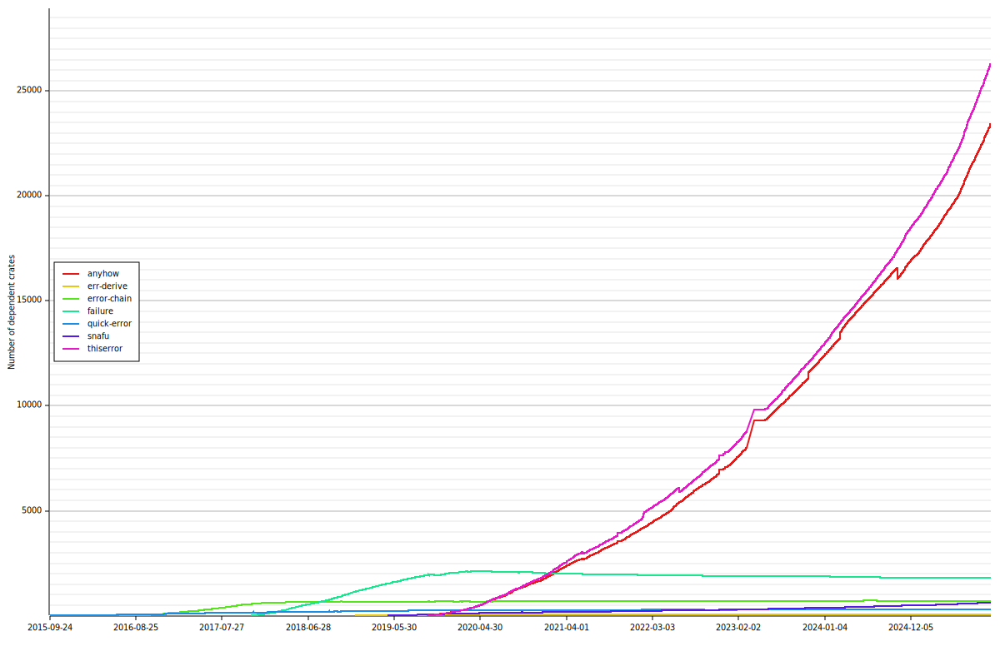

# cargo-trend

[](https://github.com/dalance/cargo-trend/actions)
[](https://crates.io/crates/cargo-trend)

cargo-trend is a cargo subcommand to generate trend graph of dependent crates.

## Installation

You can install by [cargo](https://crates.io/crates/procs).

```
cargo install cargo-trend
```

## Usage

Type `cargo trend` only. `trend.svg` show the trend graph of current project's dependencies.

```console
$ cargo trend
```

If crate names are given, `trend.svg` show the trend graph of the given crates.

```console
$ cargo trend failure error-chain quick-error snafu err-derive
```

`--output` option can specify the filename of the trend graph.
The extension can be ".svg", ".png", ".bmp", ".jpeg", ".jpg".

```console
$ cargo trend --output trend.png
```

## Sample

### Error management library

```console
$ cargo trend failure error-chain quick-error snafu err-derive
```



### Argument parser library

```console
$ cargo trend clap structopt docopt argparse getopts
```


### Terminal library

```console
$ cargo trend ansi_term termcolor term termion colored console
```


