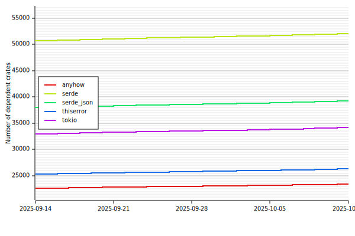
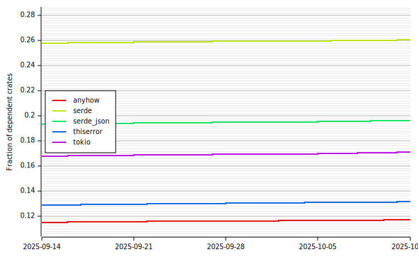
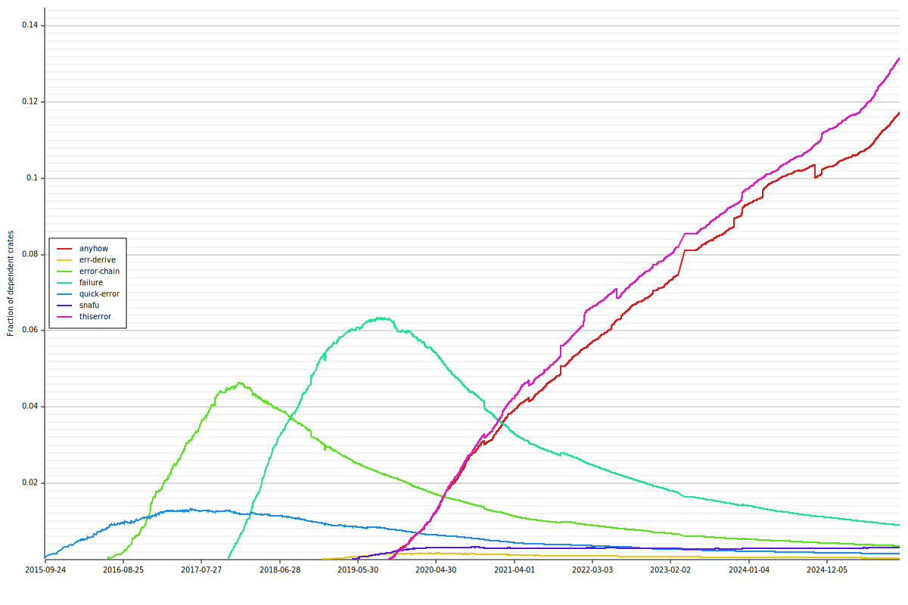
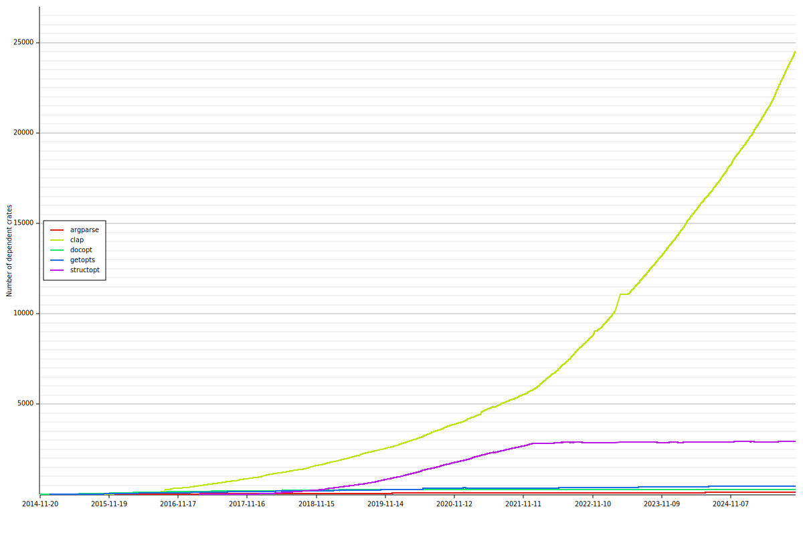
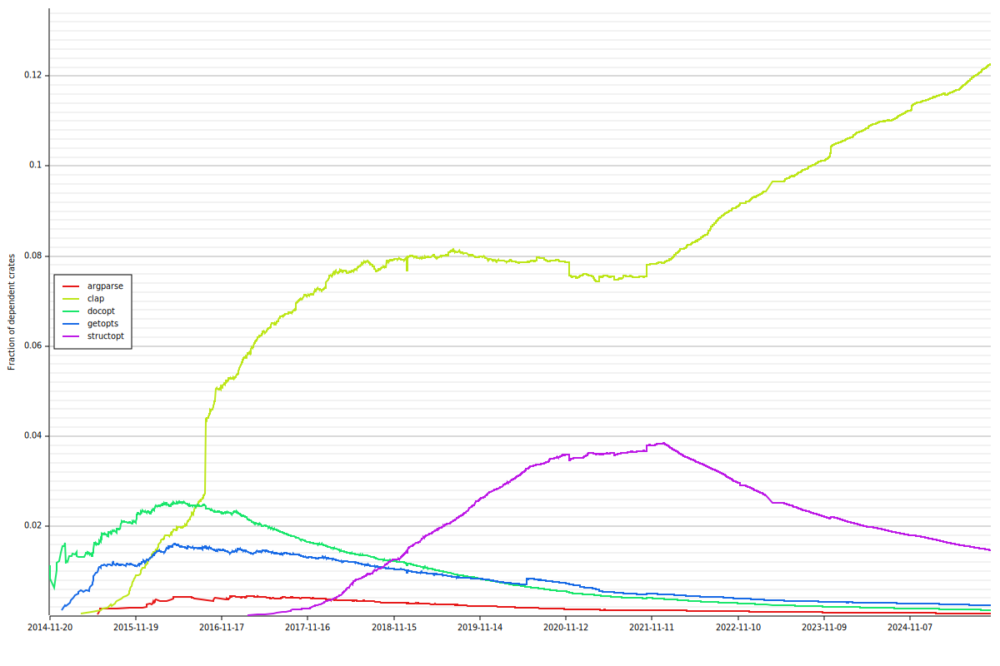
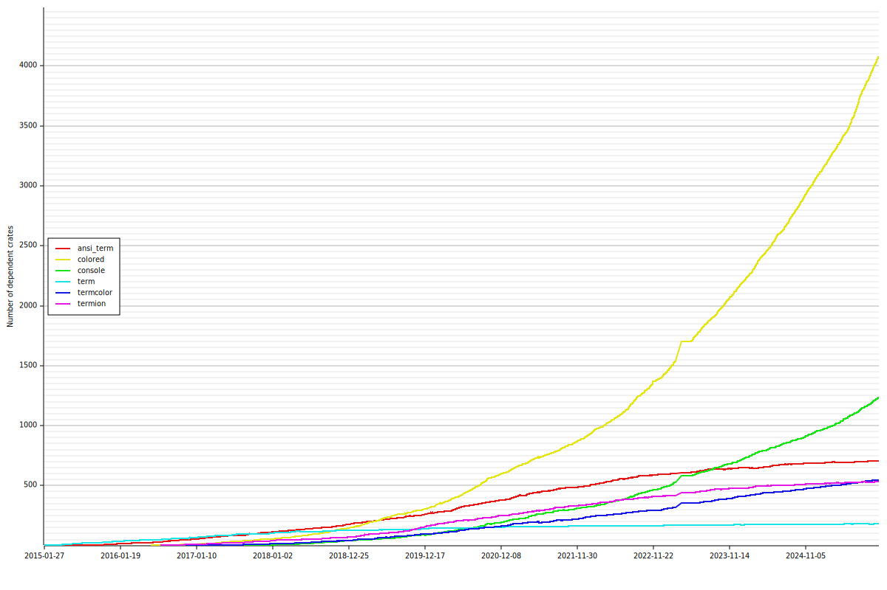
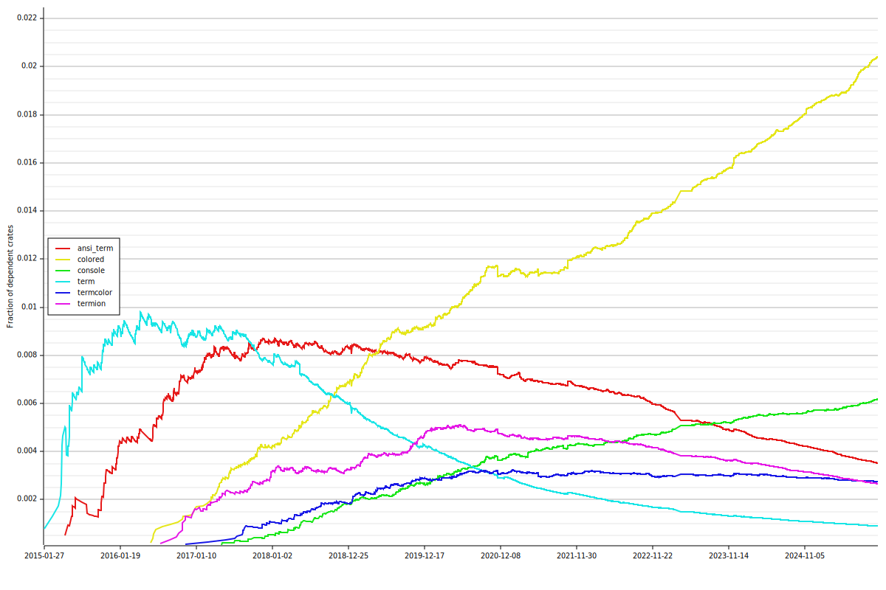

# cargo-trend

[](https://github.com/dalance/cargo-trend/actions)
[](https://crates.io/crates/cargo-trend)

cargo-trend is a cargo subcommand to generate trend graph of dependent crates.

## Installation

You can install by [cargo](https://crates.io/crates/cargo-trend).

```
cargo install cargo-trend
```

## Usage

Type `cargo trend` only. `trend.svg` show the trend graph of current project's dependencies.

```console
$ cargo trend
```

If crate names are given, `trend.svg` show the trend graph of the given crates.

```console
$ cargo trend failure error-chain quick-error snafu err-derive anyhow thiserror
```

`--output` option can specify the filename of the trend graph.
The extension can be `.svg`, `.png`, `.bmp`, `.jpeg` and `.jpg`.

```console
$ cargo trend --output trend.png
```

If `--relative` option is given, the y-axis of the output becomes fraction of crates.io.

If `--transitive` option is given, the way counting dependents changes from direct-dependencies to transitive-dependencies.

If `--top` option is given, the most trending crates are shown.

## Samples


### The most trending crates by 4 weeks

```console
$ cargo trend --top 5 --duration 4
```



```console
$ cargo trend --relative --top 5 --duration 4
```



### Error management library

```console
$ cargo trend failure error-chain quick-error snafu err-derive anyhow thiserror
```


```console
$ cargo trend --relative failure error-chain quick-error snafu err-derive anyhow thiserror
```



### Argument parser library

```console
$ cargo trend clap structopt docopt argparse getopts
```



```console
$ cargo trend --relative clap structopt docopt argparse getopts
```



### Terminal library

```console
$ cargo trend ansi_term termcolor term termion colored console
```



```console
$ cargo trend --relative ansi_term termcolor term termion colored console
```



### Async runtime library

```console
$ cargo trend tokio smol async-std
```


```console
$ cargo trend --relative tokio smol async-std
```


## Database

The database of dependent crates is `./db/db.gz`.
cargo-trend fetch it from github.com and generate graph.
The database is constructed from [crates.io-index](https://github.com/rust-lang/crates.io-index) and updated daily.
